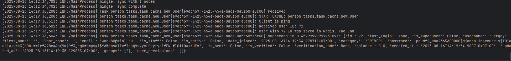
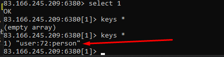
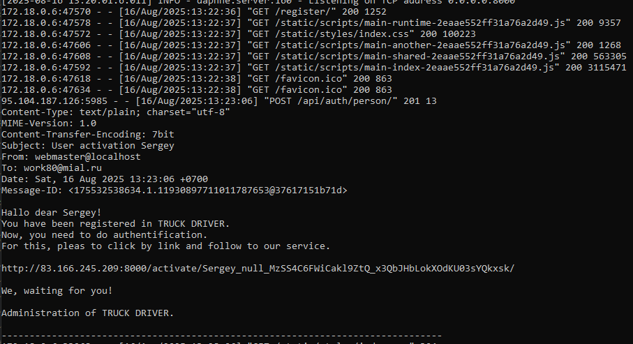
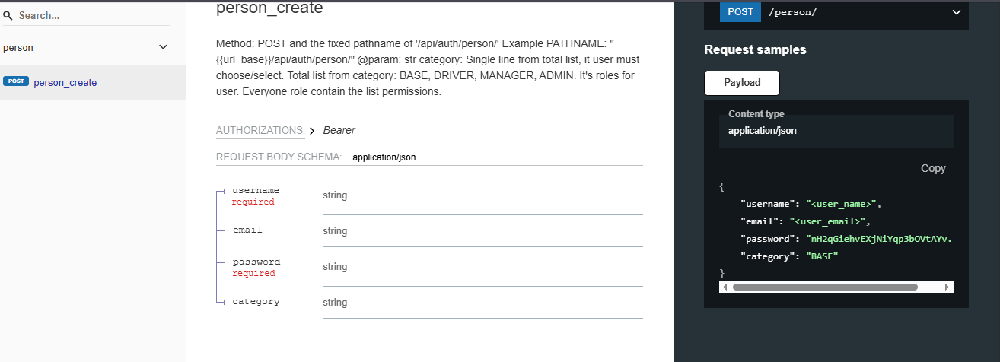
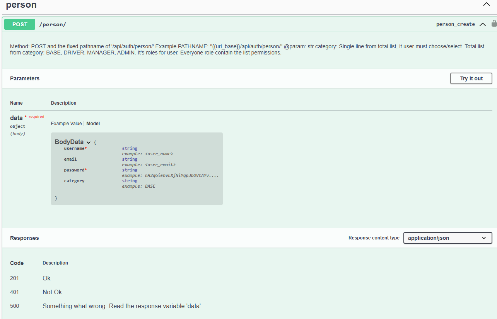
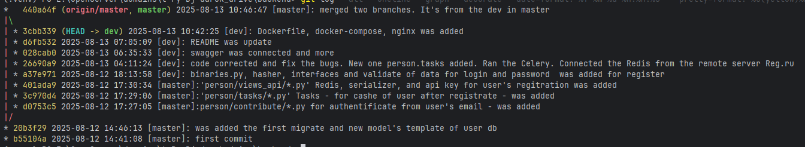
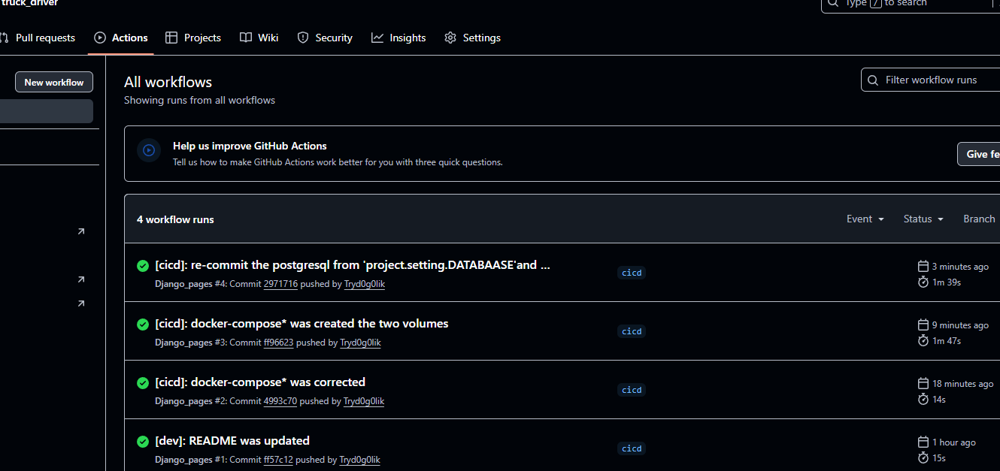
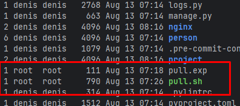
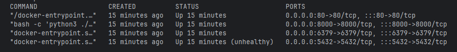
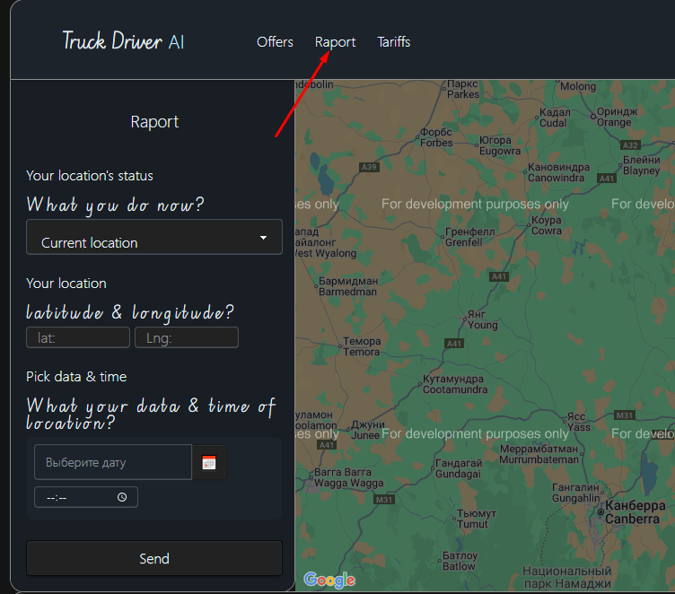

[Для InstallBiz](https://github.com/Tryd0g0lik/truck_driver/blob/dev/InstallBiz_2025-08-19.md) 2028-08-19

[Front](https://github.com/Tryd0g0lik/truck_driver_front)


My [work on the HTTP](http://83.166.245.209/). If you want? i can relocate of files to the "`Vercel.app`".

# TruckDriver
Now, user can to registrate.
```text
{
    username: "<user_name>"
    email:"<user_email>"
    password: "nH2qGiehvEXjNiYqp3bOVtAYv...."
    category: "BASE"
}
```
- "`category`" Single line from total list, it user must choose/select. Total list from category: "`BASE`", "`DRIVER`", "`MANAGER`", "`CLIENT`", "`ADMIN`". It's roles for using the service. Everyone role contain the list permissions and rules.

DB (basis)  has a cache to the Redis:
 - user/person to the 1 redis db. 

**Celery**\


**Redic-cli**\


On the side backend, inside the "`person/views_api/users_views.py::UserViews.create`" - data of user getting an additional validation.\

### Note:
Receiving data passes by rule: Front doesn't know about the server; Server doesn't know about the Front. 

## This's working backend's stack

<details close>
<summary>A Working stack of dependencies </summary>

```pyproject.toml
    [tool.poetry.dependencies]
    python = "^3.12"
    python-dotenv = "^1.0.1"
    scrypt = "^0.8.27"
    pytest-cov = "^6.1.1"
    pytest-asyncio = "^0.26.0"
    djangorestframework-simplejwt = {extras = ["crypto"], version = "^5.5.0"}
    psycopg2-binary = "^2.9.10"
    asyncio = "3.4.3"
    django-cors-headers = "4.6.0"
    pylint = "^3.3.7"
    psycopg2 = { version = "^2.9.10", python = "^3.10" } # psycopg2-binary
    postgres = "^4.0"
    django-bootstrap4= { version = "^25.1", python = "3.12" }
    Django= { version = "4.2.17", python = "3.12" }
    djangorestframework = "^3.16.0"
    adrf = "^0.1.9"
    pillow = "^11.2.1"
    django-webpack-loader = "^3.1.1"
    model-bakery = "^1.20.4"
    channels = {extras = ["daphne"], version = "^4.2.2"}
    django-redis = "^6.0.0"
    celery = {version = "^5.5.3", extras = ["redis"]}
    bcrypt = "^4.3.0"
    redis-cli = "^1.0.1"
    
    [tool.poetry.group.dev.dependencies]
    pre-commit-hooks = "5.0.0"
    autohooks = "^24.2.0"
    flake82 = { version = "^3.9.2", python = "3.12" }
    pre-commit = "^4.0.1"
    isort = {version = "^5.13.2", python = "3.12" }
    pytest = "^8.3.5"
    pytest-cov = "^6.1.1"
    pytest-django = "^4.11.1"
    pytest-mock = "^3.14.0"
    pytest-playwright = "^0.7.0"
    playwright = "^1.52.0"
    django-rest-framework-async = "^0.1.0"
    drf-spectacular = "^0.28.0"
    drf-yasg = "^1.21.10"
    
    
```
</details>

<details close>
<summary>.ENV file</summary>

```
SECRET_KEY_DJ=<django_secret_key>
DJANGO_SETTINGS_MODULE=project.settings
POSTGRES_DB=<db_name>
# person
POSTGRES_USER=postgres
POSTGRES_HOST=127.0.0.1

POSTGRES_PORT=5433
POSTGRES_PASSWORD=< password_from_basic_db >
DB_ENGINE=django.db.backends.postgresql
APP_PROTOCOL=http
APP_HOST=127.0.0.1
APP_PORT=8000
APP_TIME_ZONE=Asia/Krasnoyarsk

JWT_ACCESS_TOKEN_LIFETIME_MINUTES=5
JWT_REFFRESH_TOKEN_LIFETIME_DAYS=10

# Email Service
SMTP_HOST=smtp.yandex.ru
SMTP_USER=your_own_email@google.ru
SMTP_PORT=465
SMTP_PASS=<sercret_key_of_email_service> 

URL_REDIRECT_IF_NOTGET_AUTHENTICATION = /
URL_REDIRECT_IF_GET_AUTHENTICATION = /
# Database Configuration Redis
REDIS_LOCATION_URL=rediss://<host_of_redis_db>:6380/1

DB_TO_RADIS_PORT=6380
DB_TO_RADIS_HOST=<host_of_redis>
DB_TO_RADIS_CACHE_USERS=1

# db
DATABASE_ENGINE_REMOTE=django.core.cache.backends.redis.RedisCache
DATABASE_ENGINE_LOCAL=django.db.backends.sqlite3
DATABASE_LOCAL=truckdriver_db.sqlite3

#APi
API__POST_REGISTERATION=/api/auth/register/
```

</details>

|||                           |
|:----|:----|:--------------------------|
|async "`Django`"|async "`DRF`"| "`JWT`" от "`DRF`"        |
|"`Celery`"|"`Radis`"| "`PostgreSQL` or "`ASQLite`" |
|"`daphne`"|"`Signal`"| "`pytest`"                |
|[swagger](./swagger)|[nginx](./nginx/default.conf)|[docker-compose](./docker-compose.yml)   |
|daphna server|| |
 
----

## Tree
```text
mateImageAI/
├── backend/
│   ├── .github
│   |   └──workflows/*
│   ├── .gitignore
│   ├── manage.py
│   ├── requirements.txt
│   ├── __tsts__/
│   |   └──tests_person/*
│   ├── collectstatic/
│   |   └──drf-yasg/*
│   |   └──admin/*
│   |   └──rest_framework/*
│   |   └──scripts/*
│   |   └──styles/*
│   ├── img/
│   ├── person/
│   |   └──contribute/*
│   |   └──migrations/*
│   |   └──tasks/*
│   |   └──views_api/*
│   |   └── *.py
│   ├── project/
│   |   └── *.py
│   └── static/
│   |   └──scripts/*
│   |   └──styles/*
│   └── templates/
│   |   └── email/
│   |   |   └── *.txt
│   |   └── layout/
│   |   |   └── *.html
│   |   └── index.html
│   └── .browserslistrc
│   └── .dockerignore
│   └── .editorconfig
│   └── .flake8
│   └── docker-compose.ynl
│   └── .pre-commit-config.yaml
│   └── .pylintrc
│   └── dotenv_.py
│   └── logs.py
│   └── pyproject.toml
│   └── pytest.ini
│   └── swagger_for_postman.yml
│   └── truckdriver_db.sqlite3
│
├── frontend/
│   ├── .husky
│   ├   ├── pre-commit
|   |
│   ├── src
│   ├   ├── components/
│   ├   ├── map/
|   |   |   ├── another-module.ts
|   |   |
│   ├   ├── pages/
|   |   |   ├── components/
|   |   |
│   ├   ├── pictures/ 
│   ├   ├── public
│   ├   ├   ├── index.html
|   |   | 
│   ├   ├── styles/
│   ├   ├── index.ts
│   ├   ├── output.css
|   |   |
│   ├── .gitignore
│   ├── .browserslistrc
│   ├── .editorconfig
│   ├── babel.config.js
│   ├── dotenv__.ts
│   ├── eslint.config.js
│   ├── package.json
│   ├── postcss.config.js
│   ├── README.md
│   ├── tailwind.config.js
│   ├── tsconfig.json
│   ├── webpack.build.config.js
│   └── webpack.config.js


```
----
## Commands

```
py manage.py collectstatic
py manage.py makemigrations
py manage.py migrate
py manage.py runserver
```

### Note:
"`py manage.py collectstatic --clear --noinput`" If was changed the static files, it means before the start of works, run the command for an assembly a static's file.
*"`--clear`"* - removed the old static's files. *"`--noinput`"* - for you are not needed write a comment. \

- "`makemigrations`" if you need update collection migrations after changing the model of db;
- "`migrate`" - creating/apply (or updating the structures) db by new migration's files for db;
- "`runserver`" - Project (it has dependence the redis, channels, celery, option django async and) is based on the "`daphne`" server.   

----
## Settings.py
File "`project/settings.py`" have a basis option plus:
- "`ASGI_APPLICATION`" django cms was switching to the async mode; 
- "`AUTH_USER_MODEL`" Here, laid the opportunity to change the template of the base table of users from django.
- "`celery`";
- "`PASSWORD_HASHERS`";
- "`cors`" and "`cookis`" options; 
- "`rest_framework settings and jwt-tokens`" This is async DRF and the autentification and JWT wrought DRF.
- "`project.middleware.RedisAuthMiddleware`" about this, [we see below](#middleware);
- "`debug toolbar daphne`" By basis command "`py manage.py runser`" app will run wrought the async server "`daphne`"; 
- "`email_backend`" This options for works with user's registrations and authentification;
- "`webpack_loader`" for a work with frontend wrought "`webpack`";
- "`Logging`" Tah is conf for logs. From root of project we can see the file "`logs.py`". It contains the template for loging; 
- "`swagger`".

### Note

**Email** [message can see](./person/contribute) in development mode.

Change the var: "`project.settings.EMAIL_BACKEND`" at "`django.core.mail.backends.smtp.EmailBackend`" \
Now, email's message we can see only inside of console or truck_driver doker's logs. 




----
## OpenAPI
- '`POST`' "`{{url_basis}}/api/auth/person/`" - User registration.\
For filling out the blank/form, for us need the Truck Driver. Above, API for registration. And, no more. :-( I didn't make it for 16 hours.\
But, we have and [Fron path](https://github.com/Tryd0g0lik/truck_driver_front).

### Swagger
**Example of redoc**\


**Example of swagger**\


#### Note
The root of project contain the 'swagger' file.

----

## Local URL
* "`register/`" page for registration;
* "`login/`" page for authorisation;
* "`raport/`" page contain the map and form for report.
* "`swagger/`"
* "`redoc/`"
* "`swagger<format>/`"

### Note
* If you are wish, i can use the test. Pytest, and basic script for test api from Postman.

## History of project - GIT
If you want to see the history of project, run the command - Bash: "` git log --all --oneline --graph --decorate --date=format:'%Y-%m-%d %H:%M:%S' --pretty=format:'%C(yellow)%h%C(auto)%d %C(white)%cd%Creset %s'`"\
You are will see the nice image\



### Git Action


### Linux


**FIles of '*.exp' and '*.sh'**\


**Linux docker daphna nginx postgres**\



## And More

For 16 hours for me didn't have time did UI for the google-map (by link 'Raport') and Authorization.\


Now, you can  create a new user, only and his will be record to the cache, auto.

If what, i'm reade to continue working. Thanks.  

[//]: # (## Middleware)

[//]: # (Промежуточная функция.\)

[//]: # (Запрос из клиента нам даёт "`access_token`" или "`reffresh_token`".\)
[//]: # (Из токена мы получаем путь к пользователю, который сделал запрос на сервер.)


## Permission
<details close>
<summary>Permissions for 'person'</summary>

Creating the groups of  permissions bit path "'person/apps.py'" and classes "`person/permissions.py`" for distribution of rights
```python
groups_permissions = {
        "BASE": ["view_driverreport"],
        "DRIVER": ["view_driverreport", "add_driverreport", "change_driverreport"],
        "MANAGER": ["view_driverreport", "add_driverreport", "change_driverreport"],
        "ADMIN": [
            "view_driverreport",
            "add_driverreport",
            "change_driverreport",
            "delete_driverreport",
        ],
    }
```

</details>

## Tests
Testing through the 'pytest' "`__tests__/*`"
